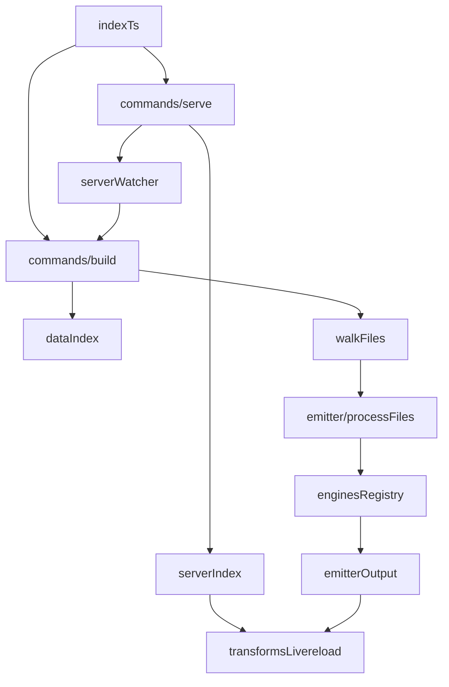

# Zero-Dependency SSG Migration TODO

Project plan for migrating to a custom SSG with zero third-party dependencies (except @types/node).

**Status:** Done | In progress | Not started | Blocked

---

## 1. Template System

**Documentation:** `[core/parser/README.md](core/parser/README.md)`

### 1.2 Frontmatter Parser


| Feature                                                                                       | Status      |
| --------------------------------------------------------------------------------------------- | ----------- |
| Delimited frontmatter (`---` … `---`), flat keys, YAML-style comments (`#`)                   | Done        |
| Indented blocks: nested maps (e.g. `external:` with child keys), list-style arrays (`- item`) | In progress |
| Full YAML 1.x spec compliance                                                                 | Not started |
| Cover every frontmatter shape in `_posts/*.md` (and fixtures) without silent mis-parse       | In progress |


**Remaining gaps:** `parseFrontmatter` in `core/parser/frontmatter/parser.ts` is a custom YAML-like subset (indent walks, list vs map blocks), not a full YAML implementation. Exercise against all `_posts/*.md` (and fixtures); extend the parser or document unsupported syntax as needed.

### 1.3 Markdown Parser


| Feature                       | Status      |
| ----------------------------- | ----------- |
| Tokenizer (markdown → tokens) | Not started |
| Parser (tokens → AST)         | Not started |
| HTML renderer (AST → HTML)    | Not started |
| Integration with frontmatter  | Not started |

---

## 2. HTML Processing

### 2.1 HTML Parser

**Dependency for:** HTML Minifier


| Feature                       | Status      |
| ----------------------------- | ----------- |
| Tokenizer (raw HTML → tokens) | Not started |
| Parser (tokens → AST)         | Not started |
| AST traversal utilities       | Not started |


### 2.2 HTML Minifier

From `eleventy.config.js` (production only). **Requires:** HTML Parser


| Feature                         | Status      |
| ------------------------------- | ----------- |
| Comment removal                 | Not started |
| Whitespace collapsing           | Not started |
| Production-mode only flag check | Not started |
| Only process `.html` files      | Not started |


---

## 3. CSS Processing

### 3.1 CSS Parser

**Shared dependency for:** @import resolver, minifier, autoprefixer


| Feature                       | Status      |
| ----------------------------- | ----------- |
| Tokenizer (CSS text → tokens) | Not started |
| Parser (tokens → AST)         | Not started |
| AST traversal utilities       | Not started |

### 3.3 CSS Minifier

From `eleventy.config.js` (via `cssnano`). **Requires:** CSS Parser


| Feature                                      | Status      |
| -------------------------------------------- | ----------- |
| Whitespace removal                           | Not started |
| Comment removal                              | Not started |
| Property optimization (shorthand conversion) | Not started |
| Production-mode only                         | Not started |


### 3.4 CSS Autoprefixer

From `eleventy.config.js` (via `autoprefixer`). **Requires:** CSS Parser. **Note:** May not be needed if targeting modern browsers only.


| Feature                                              | Status      |
| ---------------------------------------------------- | ----------- |
| Browser compatibility rules                          | Not started |
| Property detection (flexbox, grid, transforms, etc.) | Not started |
| Vendor prefix injection (-webkit-, -moz-, -ms-)      | Not started |


---

## 4. Syntax Highlighting

**Replaces:** `@11ty/eleventy-plugin-syntaxhighlight`

### 4.1 Code Block Detector


| Feature                                | Status      |
| -------------------------------------- | ----------- |
| Markdown fence detection (```language) | Not started |
| Language attribute extraction          | Not started |
| Integration with markdown parser       | Not started |


### 4.2 Syntax Highlighter


| Feature                                               | Status      |
| ----------------------------------------------------- | ----------- |
| Token classification (keyword, string, comment, etc.) | Not started |
| HTML generator with class names                       | Not started |
| Language detection/fallback                           | Not started |
| Pre-attributes support (tabindex, data-language)      | Not started |


### 4.3 Language Grammars

Tokenizer per language:


| Language              | Status      |
| --------------------- | ----------- |
| JavaScript/TypeScript | Not started |
| CSS                   | Not started |
| HTML                  | Not started |
| Markdown              | Not started |
| Shell/Bash            | Not started |
| JSON                  | Not started |
| Others                | Not started |


---

## 5. Build System

### 5.4 Asset Management

From `eleventy.config.js`:


| Feature                                                  | Status      |
| -------------------------------------------------------- | ----------- |
| Passthrough copy for `assets/`, `scripts/`, `_redirects` | Done        |
| Directory structure preservation                         | Done        |
| Asset bundling                                           | Not started |


---

## 6. Migration Tasks

### 6.3 Dependency Removal

**Phase 5 - Cleanup** (only after full feature parity)


| Task                                              | Status  |
| ------------------------------------------------- | ------- |
| Remove `@11ty/eleventy` and plugins               | Blocked |
| Remove `postcss`, `postcss-cli`, `postcss-import` | Blocked |
| Remove `autoprefixer`, `cssnano`                  | Blocked |
| Remove `html-minifier`                            | Blocked |
| Remove `cross-env`                                | Blocked |
| Update package.json scripts                       | Blocked |
| Archive `eleventy.config.js` for reference        | Blocked |


---

## 7. Code Quality & Architecture

### 7.3 Type Safety: Remove `as` casts where narrowing suffices

The parser uses `as TokenIdent` / `as TokenKeyword` casts *before* the runtime type check on the next line. If the value is `undefined`, the cast silently lies. Check first, then the type is narrowed automatically.


| Task                                       | Status      | File                                                         |
| ------------------------------------------ | ----------- | ------------------------------------------------------------ |
| `variable` cast in `parseIterationHeader`  | Done        | `core/parser/liquid/parser.ts:542` — narrowed via type check |
| `inKeyword` cast in `parseIterationHeader` | Done        | `core/parser/liquid/parser.ts:553` — narrowed via type check |
| `nameToken` cast in `capture` branch       | Not started | `core/parser/liquid/parser.ts`                               |
| `params` cast in for-loop param parsing    | Not started | `core/parser/liquid/parser.ts`                               |
| `param` cast in tablerow param parsing     | Not started | `core/parser/liquid/parser.ts`                               |


### 7.8 Test Coverage: Add tests for untested modules

The parser and utility modules are well covered. The integration layer (build, traverse, data, posts) has no dedicated tests.


| Module                                              | Risk   | Status      |
| --------------------------------------------------- | ------ | ----------- |
| `core/data/posts.ts` (date parsing, URL generation) | Medium | Not started |
| `core/data/loader.ts` (file loading, error paths)   | Medium | Not started |
| `core/data/index.ts` (data merging, `pickValues`)   | Medium | Not started |
| `core/emitter/traverse.ts` (file processing)        | High   | Not started |
| `core/emitter/posts.ts` (post compilation)          | Medium | Not started |
| `core/server/index.ts` (request handling, 404, upgrade) | Medium | Not started |
| `core/server/livereload.ts` (WS handshake, broadcast) | Medium | Not started |
| `core/server/watcher.ts` (debounce, coalesced queue)  | Low    | Not started |


---

## 8. Core refactor backlog

Ongoing `core/` improvements that are not full migration milestones. Pick in rough priority order; gate risky parser work with the **testing matrix** at the end of this section. Earlier milestones (path resolve, `loadFile`, livereload in transforms, single walk + engines for posts, passthrough routing, `core/commands/build.ts` + `serve.ts`, thin `core/index.ts`, `getCollections` / `indexCollections`, `core/emitter/passthrough.ts`, removal of `copy.ts` / `writeCollection`) are done and not listed here.

Overlaps with [§7](#7-code-quality--architecture): loader/collections typing (7.5) aligns with items **2** and **3** below — one boundary design can satisfy several rows.

### 8.1 Parser: control flow, scope, spans, registry

**Where:** `core/parser/liquid/renderer.ts`, `parser.ts`, `types.ts`, `utils.ts`, `test/parser/`.


| Track                         | Status      | Notes                                                                                                                                 |
| ----------------------------- | ----------- | ------------------------------------------------------------------------------------------------------------------------------------- |
| Return-based loop control     | Not started | Replace `BreakSignal` / `ContinueSignal` throws for normal loop flow where practical.                                                 |
| Scope semantics               | Not started | Loop `Object.create` vs Liquid expectations — document and align with tests.                                                          |
| Source spans on AST nodes     | Not started | High-value nodes need stable spans for diagnostics.                                                                                   |
| Extract `parseNodes` branches | Not started | Large branch in `parser.ts` — extract tag handlers when adding more tags.                                                             |

**Exit:** No throw-based loop control for normal flow; assignment semantics documented and tested; high-value nodes carry spans.

### 8.2 Loader: discriminated results

**Where:** `core/data/loader.ts` (`readOrImport`, `loadFromDir`, `loadFromFile`), `core/data/index.ts` (callers).


| Track                                      | Status      | Notes                                                                                    |
| ------------------------------------------ | ----------- | ---------------------------------------------------------------------------------------- |
| `{ ok: true, value } \| { ok: false, … }` | Not started | Replace loose `unknown` + downstream casts at boundaries; callers pattern-match.          |

**Exit:** No silent `null` + cast chains. Complements §7.5 (`isRecord` / malformed data) — decide whether both apply or one subsumes the other.

### 8.3 Stronger typing for global data / collections

**Where:** `core/data/index.ts` (`DataFileMap`), `core/data/collections.ts` (`getCollections` may still use a cast).


| Track                                   | Status      | Notes                                                                                               |
| --------------------------------------- | ----------- | --------------------------------------------------------------------------------------------------- |
| Narrow `DataFileMap` / facade for picks | Not started | Discriminated keys or small facade so `'collections'` reads without `as` at the call site.          |

**Exit:** No `as Record<string, CollectionEntry[]>` on production paths (or isolated to one boundary guard).

### 8.4 DevEx: correlation + log labels

**Where:** `core/utils/log.ts`, logger callsites across build / emitter / parser.


| Track                         | Status      | Notes                                                         |
| ----------------------------- | ----------- | ------------------------------------------------------------- |
| `operationId` per build       | Not started | Hierarchical labels (`emitter.output`, `parser.render`) meta. |

**Exit:** Grep logs by one id for a full build story.

### 8.5 Utilities: path normalisation + shared walker

**Where:** `core/data/collections.ts` (permalink / URL helpers), `core/utils/path.ts`, `core/utils/fs.ts` (`walkFiles`).


| Track                         | Status      | Notes                                                         |
| ----------------------------- | ----------- | ------------------------------------------------------------- |
| Unify slash + site-path rules | Not started | e.g. `normaliseSitePath`; one place for public URL segments.  |
| Shared directory walker       | Not started | Optional if copy and discover diverge again.                  |

### 8.6 Transforms layout (optional)

**Where:** `core/transforms/` (livereload, minify, css-imports). **Only** if it reduces mental load: input vs output transform folders or renames.

### 8.8 Livereload testability (optional)

**Where:** `core/transforms/livereload.ts`. Refactor module-global WebSocket / client set only if multi-instance or unit tests without globals are needed.

### 8.10 Architecture (current)



Collections are indexed in `core/data/collections.ts` and matched during the same walk; posts compile through `site-template` like other template extensions.

### 8.11 Testing matrix (refactor / parser gates)

- **Regression:** Spot-check representative pages + posts HTML after parser or pipeline edits (no legacy output baseline required).
- **Parser:** `for` + assign, `break` / `continue`, nested `if` / `for`, unknown filter / shortcode errors.
- **Runtime:** Dev server serves `.build`, path traversal blocked, livereload upgrade + reload.
- **Data:** Missing `src/data`, bad JSON, `customDataMapping` field pick.

Shrink or delete §8 subsections when done so this file stays honest.
