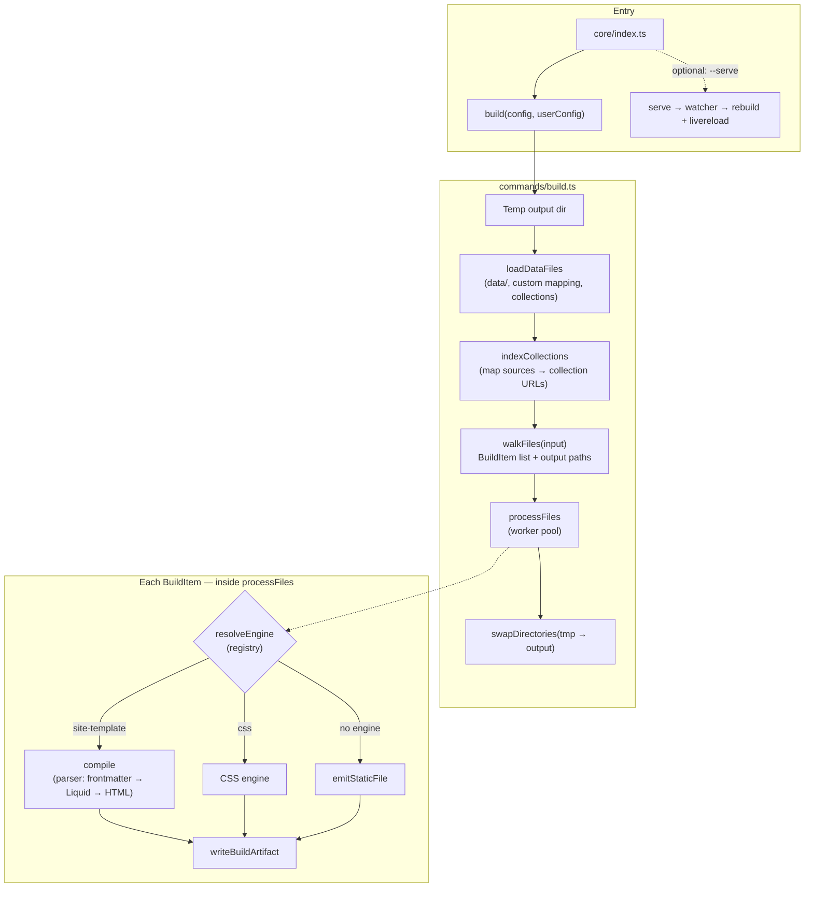

# Core SSG pipeline

High-level flow from the CLI entry through build output.

```mermaid
flowchart TD
	subgraph entry["Entry"]
		A["core/index.ts"] --> B["build(config, userConfig)"]
		A -. "optional: --serve" .-> S["serve → watcher → rebuild + livereload"]
	end

	subgraph buildCmd["commands/build.ts"]
		B --> T["Temp output dir"]
		T --> D["loadDataFiles\n(data/, custom mapping, collections)"]
		D --> I["indexCollections\n(map sources → collection URLs)"]
		I --> W["walkFiles(input)\nBuildItem list + output paths"]
		W --> P["processFiles\n(worker pool)"]
		P --> X["swapDirectories(tmp → output)"]
	end

	subgraph each["Each BuildItem — inside processFiles"]
		R{"resolveEngine\n(registry)"} -->|"site-template"| C["compile\n(parser: frontmatter → Liquid → HTML)"]
		R -->|"css"| G["CSS engine"]
		R -->|"no engine"| F["emitStaticFile"]
		C --> O["writeBuildArtifact"]
		G --> O
		F --> O
	end

	P -.-> R
```
